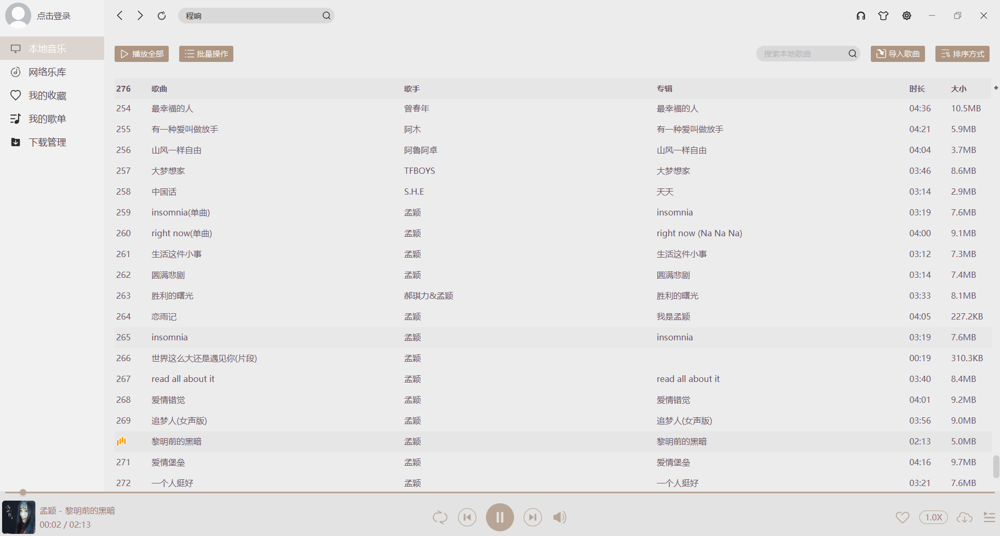
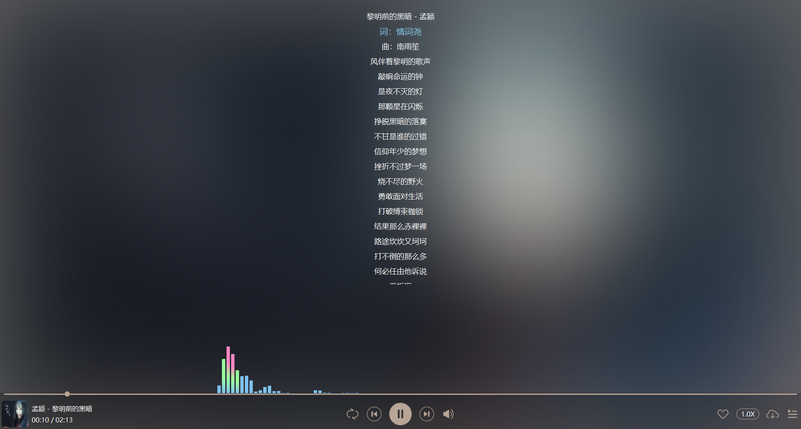
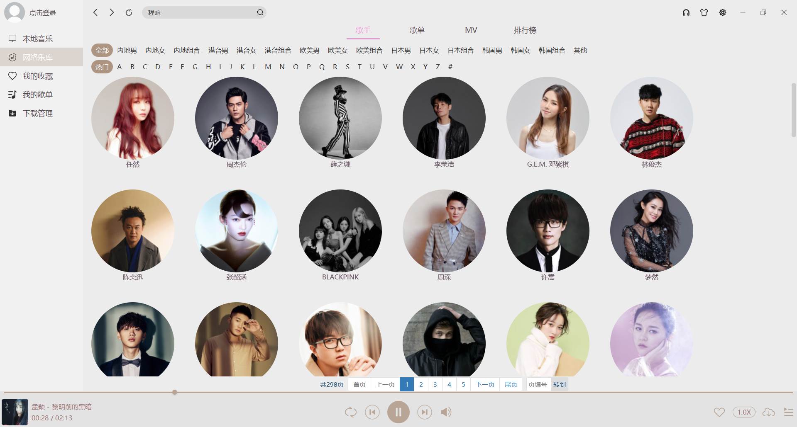
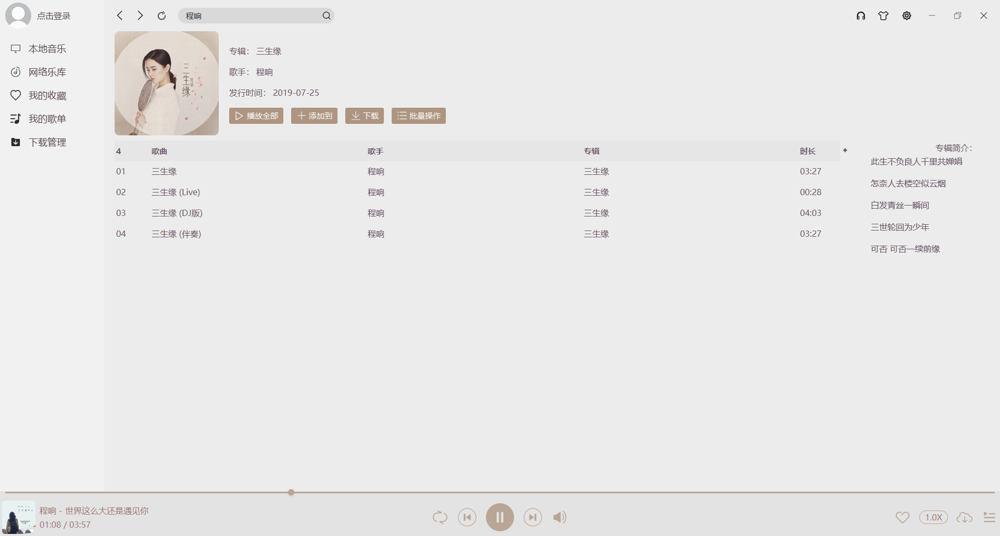
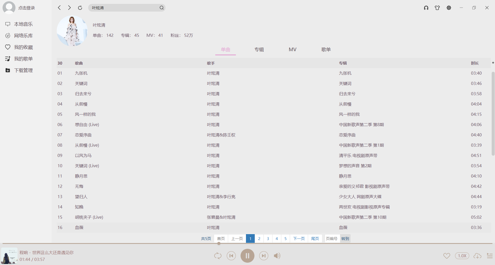

## MQPlayer
MQ音乐是一个构建在Java和JavaFX平台之上的跨平台音乐播放器

### 项目技术栈

    
    
    
    
    
    

### 特性
1. 支持音乐频谱
2. 高度支持自定义UI组件
3. 界面友好，支持皮肤切换，也可自定义样式
4. 跨平台，无需安装，仅需要Java运行时环境即可
5. 支持播放器解码器切换(JavaFX内置播放器和VLCJ播放器)

6. 良好的架构模式和代码风格
7. 提供支持主流的3个第三方音乐平台(仅作为学习目的，也未公开)

### 架构
本软件采用主流的三层架构和MVC模式

|  编号    | 包/资源 | 明细 |
| ------   | ------ | ----- |
|  1   | com.scmq.player.app        | 主程序入口 |
|  2   | com.scmq.player.controller | 所有控制器 |
|  3   | com.scmq.player.core       | 播放器核心实现 |
|  4   | com.scmq.player.dao        | mapper(DAO)接口 |
|  5   | com.scmq.player.io         | IO操作和歌词支持的类 |
|  6   | com.scmq.player.model      | 数据模型类 |
|  7   | com.scmq.player.net        | 提供网络支持的类 |
|  8   | com.scmq.player.service    | 所有业务类 |
|  9   | com.scmq.player.util       | 所有工具类 |
|  10  | com.scmq.player.view       | 视图类 |
|  11  | com.scmq.view.control      | 自定义UI组件 |
|  13  | res/icon/player            | 播放器专用图标 |
|  12  | res/icon                   | 图标 |
|  14  | res/mapper                 | mapper映射文件 |
|  15  | res/style                  | UI样式 |

***
### 效果预览
+ 本地音乐

+ 播放详情

+ 歌手分类

+ 歌手详情

+ 歌手专辑

+ 专辑详情

+ 歌手MV

+ 资源搜索

